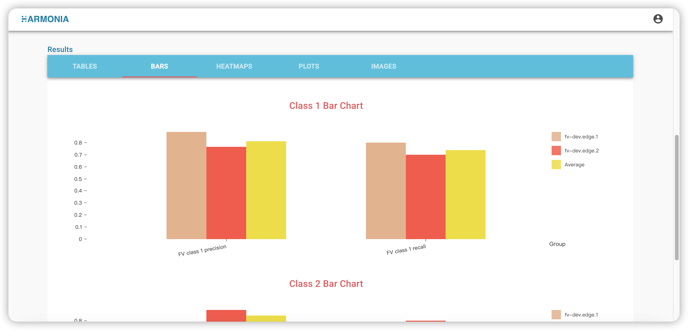

# Ailabs FV (federated validation) framework

Ailabs FV framework 是由Ailabs所開發出的一套聯合驗證的框架，開發者製作一個符合框架規範的docker image，即可
將其docker image使用在Ailabs FV的專案之中。

* 開發者docker image經由滿足下述條件:
  * 完成驗證用的資料集的輸入 (The datasets importing for FV)
  * 完成在FV過程之中的進度(progress.json)輸出 (Output progress.json while the FV is in progress)
  * 完成驗證結果(result.json)的輸出 (Output result.json after the FV is done)


## The FV (federated validation) msc

<div align="left"></img></div>

Here we can see what will be done while we are doing a federated validation with our Ailabs's FV framework.

When a FV plan starts, the edge dashboard will automatically launch the container and start doing validation.

As we can see in diagram, there are 4 phases that will go through in a FV plan.
`initialization`,`preprocessing`,`validating` and `completed`.

At each phase, the container should output the corresponding *progress.json* to tell the progress of FV。 

Ailabs 預期開發者會在`initialization`這個階段進行所有聯合驗證前的初始化動作，例如載入模型與權重、載入資料集等。
而下一個階段`preprocessing`則是被預期會進行例如資料集的前處理與再加載或其他須預先處理的事項(若前處理需求可跳過此階段)，接下來的階段即為`validating`，即為驗證正在進行中，完成後進入`completed`階段。

以上四個階段(可略過`preprocessing`若開發者沒有前處理需求)，皆須輸出一個progess.json的檔案，以便Ailabs FV framework追蹤開發者的FV container的狀態。


# The datasets importing for FV

我們在進行聯合驗證前，開發者所製作的docker image需要進行資料集的輸入，而資料集的位置會放在開發者的PI其創建一個FV plan[創建一個FV plan](https://harmonia.taimedimg.com/flp/documents/fv/1.0/manuals/ch3/3-2-how-to-setup-a-federated-validating-plan)時所指定的位置，如下。

<div align="left"></img></div>

開發者在進行FV操作途中會使用edge dashboard將其資料集(以zip格式)上傳[FV上傳資料集](https://harmonia.taimedimg.com/flp/documents/fv/1.0/manuals/ch5/5-2-how-to-upload-validating-datasets)，我們的edge dashboard會將開發者上傳的zip解壓縮並放到上述的指定的位置，即可開始聯合驗證下一步。


## Output progress.json while the FV is in progress

The  *progress.json*  has content as below. 

* 當進行initialization階段的時候，progress.json須輸出如下內容，進度改變即進行更新一次。
  ```bash
    {
      "status": "initialization",
      "completedPercentage": 50
    }
  ```

* 當進行preprocessing階段的時候，progress.json須輸出如下內容，進度改變即進行更新一次。
  ```bash
    {
      "status": "preprocessing",
      "completedPercentage": 20
    }
  ```
* 當進行preprocessing階段的時候，progress.json須輸出如下內容，進度改變即進行更新一次。
  ```bash
    {
      "status": "validating",
      "completedPercentage": 20
    }
  ```
* 當進行preprocessing階段的時候，progress.json須輸出如下內容，進度改變即進行更新一次。
  ```bash
    {
      "status": "completed",
      "completedPercentage": 20
    }
  ```

  這個*progress.json*須放在當開發者的PI創建一個FV plan[創建一個FV plan](https://harmonia.taimedimg.com/flp/documents/fv/1.0/manuals/ch3/3-2-how-to-setup-a-federated-validating-plan)時指定的output路徑（請注意：後面將提到的result.json，也是放在這個路徑下）。即

<div align="left"></img></div>


## The output file format of FV (federated validation) result.json

`result.json` 內容為一個json obejct，此object包含2個json object，分別是metadata和
results，其中metadata為FV的基本資訊，而results為FV的驗證結果圖表。

metadata目前僅有一項基本資訊即datasetSize，即驗證用的資料集的大小。

而results則可以附帶多種以下圖表
* tables：一維表格
  * title: string
  * labels: string array
  * values: number array

* bars：長條圖
  * title: string
  * labels: string array
  * values: number array
  * y-axis: string

* heatmaps：熱力圖
  * title: string
  * x-labels: string array
  * y-labels: string array
  * values: number 2d array
  * x-axis: string
  * y-axis: string

* plots：折線圖
  * title: string
  * labels: string array
  * x-values: number 2d array
  * y-values: number 2d array
  * x-axis: string
  * y-axis: string

* images：圖片
  * title: string
  * filename: string

### result.json的格式範本如下

```json
  {
    metadata:{
      datasetSize: 1000
    },
    results:{
      tables: [
        {
          title: "Overall Table",
          labels: ["FV accuracy"],
          values: [0.8182]
        },
      ],
      bars: [
        {
          title: "Class 1 Bar Chart",
          labels: ["F1 class 1 precsion"],
          values: [0.8564],
          y-axis: "performance",
        },
      ],
      heatmaps: [
        {
          title: "FV Confusion Matrix",
          x-labels: ["FV class0","FV class1"],
          y-labels: ["FV class0","FV class1"],
          values: [[10,5],[2,16]],
          x-axis: "Predition",
          y-axis: "Ground truth",
        },
      ],
      plots: [
        {
          title: "FV Confusion Matrix",
          labels: ["ROC curve"]
          x-values: [[0,0.2,0,4,0,8]],
          y-values: [[0,0.25,0.43,0.83]],
          x-axis: "True Positive rate",
          y-axis: "Faise Positive rate",
        }
      ],
      images: [
        {
          title: "FV image"
          filename: "fv-image.png"
        }
      ]
    }
  }
```

## result.json 與 cloud 生成圖的對應

* tables：為單個row的表格array，每個edge可以呈現多單個row表格，而cloud會將不同edge之間的單個row表格(依照表格title和label的合成為多個row的tables)，例如，若有2個edges，分別如下上傳其json如下
  * FV-dev.edge.1 上傳json中的tables部分如下
    ```json
      {
          results:{
            tables: [
              {
                title: "Overall Table",
                labels: ["FV accuracy"],
                values: [0.8182]
              },
              {
                title: "Class 1 Table",
                labels: ["FV Class 1 recall"],
                values: [0.8000]
              }
            ]
          }
      }
    ```
  * FV-dev.edge.2 上傳json中的tables部分如下
    ```json
      {
          results:{
            tables: [
              {
                title: "Overall Table",
                labels: ["FV accuracy"],
                values: [0.8964]
              },
              {
                title: "Class 1 Table",
                labels: ["FV Class 1 recall"],
                values: [0.9000]
              }
            ]
          }
      }
    ```

<div align="left"></img></div>

FV-dev.edge.1以及FV-dev.edge.2所傳送result.json，其中的tables將會在cloud報表顯示如上圖型。


* bars： 同table為單row表格array，差異點在多了一個衡量value的單位，且圖形的呈現為長條圖，例如，若有2個edges，分別如下上傳其json如下
  * FV-dev.edge.1 上傳json中的bars部分如下
    ```json
    {
        results:{
          bars: [
            {
              title: "Class 1 Bar Chart",
              labels: ["F1 class 1 precsion"],
              values: [0.8564],
              y-axis: "performance",
            },
            {
              title: "Class 1 Table",
              labels: ["F1 class 1 recall"],
              values: [0.7450]
              y-axis: "recall rate",
            }
          ]
        }
      }
    ```

  * FV-dev.edge.2 上傳json中的bars部分如下
    ```json
    {
        results:{
          bars: [
            {
              title: "Class 1 Bar Chart",
              labels: ["F1 class 1 precsion"],
              values: [0.7364],
              y-axis: "performance",
            },
            {
              title: "Class 1 Table",
              labels: ["F1 class 1 recall"],
              values: [0.6850]
              y-axis: "recall rate",
            }
          ]
        }
      }
    ```

<div align="left"></img></div>
FV-dev.edge.1以及FV-dev.edge.2所傳送result.json，其中的bars將會在cloud報表顯示如上圖型。


* heatmaps：為N*N的陣列的array，N*N陣列中的每格為一個json number，例如，若有2個edges，分別如下上傳其json如下
  * FV-dev.edge.1 上傳json中的heatmaps部分如下
    ```json
    {
        results:{
          heatmaps: [
            {
              title: "FV Confusion Matrix",
              x-labels: ["FV class0","FV class1"],
              y-labels: ["FV class0","FV class1"],
              values: [[10,5],[2,16]],
              x-axis: "Predition",
              y-axis: "Ground truth",
            },
          ]
        }
      }
    ```

  * FV-dev.edge.2 上傳json中的heatmaps部分如下
    ```json
    {
        results:{
          heatmaps: [
            {
              title: "FV Confusion Matrix",
              x-labels: ["FV class0","FV class1"],
              y-labels: ["FV class0","FV class1"],
              values: [[10,5],[2,16]],
              x-axis: "Predition",
              y-axis: "Ground truth",
            }
          ]
        }
      }
    ```

<div align="left"></img></div>
FV-dev.edge.1以及FV-dev.edge.2所傳送result.json，其中的heatmaps將會在cloud報表顯示如上圖型。

* plots: 多個折線圖的array，每個折線圖有多條折線，每個折線有一組x-axis的values和一組y-axis的values，每個折線的某個x-axis value會對應到同index的y-axis的value，labels則為每個折線圖的名稱
  * FV-dev.edge.1 上傳json中的plots部分如下
    ```json
      {
        results:{
          plots: [
            {
              title: "FV Confusion Matrix",
              labels: ["ROC curve"]
              x-values: [[0,0.2,0,4,0,8]],
              y-values: [[0,0.25,0.43,0.83]],
              x-axis: "True Positive rate",
              y-axis: "Faise Positive rate",
            }
          ]
        }
      }
    ```

  * FV-dev.edge.2 上傳json中的plots部分如下
    ```json
      {
        results:{
          plots: [
            {
              title: "FV Confusion Matrix",
              labels: ["ROC curve"]
              x-values: [[0,0.2,0,4,0,8]],
              y-values: [[0,0.35,0.43,0.83]],
              x-axis: "True Positive rate",
              y-axis: "Faise Positive rate",
            }
          ]
        }
      }
    ```

<div align="left"></img></div>
FV-dev.edge.1以及FV-dev.edge.2所傳送result.json，其中的plots將會在cloud報表顯示如上圖型。

* images: 若上面的圖型格式無法滿足呈現FV的數據結果，則可自行生成圖片，並由cloud來顯示，此時請開發者將影像放在output folder並將資訊如以下填入result.json。
  * FV-dev.edge.1 上傳json中的images部分如下

    ```json
    {
      results:{
        images: [
          {
            title: "FV image"
            filename: "fv-image.png"
          }
        ]
      }
    }
    ```

  * FV-dev.edge.2 上傳json中的images部分如下
    ```json
      {
        results:{
          images: [
            {
              title: "FV image"
              filename: "fv-image.png"
            }
          ]
        }
      }
    ```

<div align="left"></img></div>
FV-dev.edge.1以及FV-dev.edge.2所傳送result.json，其中的images將會在cloud報表顯示如上圖型。


# What is Hello FV

Easiest way for ML people to learn Ailabs's FV (federated validation) framework. Hello FV follows the latest Ailabs's FV spec with the well-known MNIST training.

After executing this project, one will fully understand the Ailabs's FV (federated validation) framework, and can quickly fit their AI model in this framework.

## Getting started

Prepare a Linux enviroment（Ubuntu is preferred) with a docker environment installed.

And simply download the MNIST datasets from Pytorch 's official site （or py the link as below）and unzip this dataset to be a folder named MNIST and put this folder in ```/data``` .

[mnist_dataset.zip]()

After the dataset has been prepared , download the model weight given as below link.

[model_weight.ckpt]()

Put the MNIST model weight in ```/var/model_weight.ckpt``` and launch the container we have made for you by executing the command below.

```bash
docker run -it --name hello-fv --runtime=nvidia \
-e NVIDIA_VISIBLE_DEVICES=0 \
-v /var/run/docker.sock:/var/run/docker.sock \
-v /bin/docker:/bin/docker \
-v /var/model_weight.ckpt:/model_weight.ckpt \
-v /var/data:/data \
-v /var:/var \
-v /var/output:/var/output \
-v /var/logs:/var/logs \
registry.corp.ailabs.tw/federated-learning/hello-fv/edge:1.1.1
```

There are some docker settings that have to be set before you launch this container. We introduce them here.

* **NVIDIA_VISIBLE_DEVICES=0** : We will need GPU to do validation,
so this value will be the index of one of your GPU cards. This value will be 0 if one just has one GPU card in their edge.

* **-v /var/data:/data** : This is the path where the container will load the dataset from. We will need datasets to be prepared before we start the validation.

* **-v /var/model_weight.ckpt:/model_weight.ckpt** : Before we do FV, we need our model's weight prepared. Put the MNIST's model weight（can be downloaded through link）at */var/model_weight.ckpt*(you can change path through altering the running command given above).

The path behind (which is the path in the container) will need to be entered while one is creating a FV plan （if you are using our Ailabs's FV cloud which will automally launch validation container).

* **-v /var/output:/var/output** : This is the path where the container output the result of validation (*result.json*).

It also needs to be entered while creating a FV plan through our Ailabs FV cloud.

You can know more about *result.json* through our wiki link as below.

* **-v /var/logs:/var/logs** : This is the path where the container outputs the logs of your container.

It also need to be entered while creating a FV plan through our Ailabs FV cloud.

* In conclusion, there are simply 4 steps to run this FV example.
    * 1.Put MNIST datasets in [dataset path]（/var/data）.
    * 2.Put MNIST model weight in [model weight path] （/var/model_weight.ckpt).
    * 3.Make sure you have correctly set NVIDIA_VISIBLE_DEVICES's value to the right GPU card (which needs to be idle).
    * 4.Launch the docker command given above.

# 關於 confusion matrix 取數值

# 關於 f1-socres/ precision / recall


