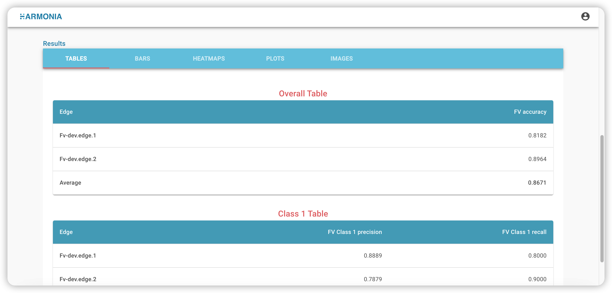
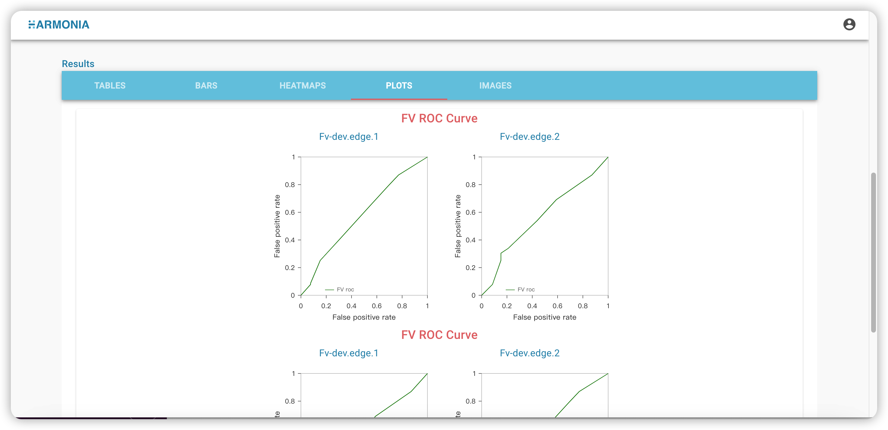

# Ailabs FV (federated validation) framework

Ailabs FV framework 是由Ailabs開發出的一套聯合驗證的框架，開發者須製作一個符合框架規範的docker image，即可
將此docker image使用在Ailabs FV的專案之中。

* 開發者的docker image須滿足下述條件:
  * 完成驗證用的資料集的輸入 (The datasets importing for FV)
  * 完成在FV過程之中的進度(progress.json)輸出 (Output progress.json while the FV is in progress)
  * 完成驗證結果(result.json)的輸出 (Output result.json after the FV is done)


# The FV (federated validation) diagram

Here we can see what will be done while we are doing a federated validation with the Ailabs FV framework.

<div align="left"></img></div>

When a FV plan starts, the edge dashboard will automatically launch the container and start doing validation.

As we can see in the diagram, there are 4 phases that will go through in a FV plan,
`initialization`,`preprocessing`,`validating` and `completed`.

At each phase, the container should output the corresponding **progress.json** to tell outside the progress of FV。 

Ailabs預期開發者會在`initialization`這個階段進行所有聯合驗證前的初始化動作，例如載入模型與模型權重、載入資料集等。
下一個階段`preprocessing`開發者被預期會進行例如資料集的預先處理與再加載或其他需要預先處理的事項(若無需求可跳過此階段)，接下來的階段即`validating`，代表已進入驗證並正在進行中，驗證完成後進入`completed`即完成階段。

以上四個階段(除了`preprocessing`無需求可略過)，每個階段都須最少輸出一個**progess.json**的檔案(已存在則覆蓋)，使Ailabs FV framework能追蹤開發者的FV的狀態，後面會再詳細解釋**progess.json**。


# The datasets importing for FV

進行聯合驗證前，開發者所製作的docker image必定需要進行資料集的輸入，資料集的位置會在開發者的PI其創建一個FV plan[創建一個FV plan](https://harmonia.taimedimg.com/flp/documents/fv/1.0/manuals/ch3/3-2-how-to-setup-a-federated-validating-plan)時所輸入，如下。

<div align="left"></img></div>

開發者在進行FV操作途中會使用edge dashboard將其資料集(以zip格式)上傳[FV上傳資料集](https://harmonia.taimedimg.com/flp/documents/fv/1.0/manuals/ch5/5-2-how-to-upload-validating-datasets)，我們的edge dashboard會將開發者上傳的zip解壓縮並放到上述的指定的位置，即可開始聯合驗證。

<div align="left"></img></div>


# Output progress.json while the FV is in progress.

The **progress.json**  has content as below. 其中`status`為階段，`completedPercentage`為階段的完成度。

* 當initialization階段的時候，progress.json須輸出如下內容，進度改變即進行更新一次。
  ```bash
    {
      "status": "initialization",
      "completedPercentage": 50
    }
  ```

* 當preprocessing階段的時候，progress.json須輸出如下內容，進度改變即進行更新一次。
  ```bash
    {
      "status": "preprocessing",
      "completedPercentage": 20
    }
  ```
* 當validating階段的時候，progress.json須輸出如下內容，進度改變即進行更新一次。
  ```bash
    {
      "status": "validating",
      "completedPercentage": 20
    }
  ```
* 當completed階段的時候，progress.json須輸出如下內容，進度改變即進行更新一次。
  ```bash
    {
      "status": "completed",
      "completedPercentage": 20
    }
  ```

  這個**progress.json**開發者在每個階段輸出一個(若存在就覆蓋)並須被放在開發者的PI創建一個FV plan[創建一個FV plan](https://harmonia.taimedimg.com/flp/documents/fv/1.0/manuals/ch3/3-2-how-to-setup-a-federated-validating-plan)指定的output路徑（後面將提到的result.json，也是放在這個路徑下），如下。

<div align="left"></img></div>


# The output file format of FV (federated validation) result.json

`result.json` 內容為一個json obejct，此object包含了2個json object，分別是metadata和
results。其中metadata為FV的基本資訊，而results為FV的驗證結果圖表。

* metadata目前僅一項基本資訊即datasetSize，代表驗證用的資料集其大小。

而results則可以附帶多種以下圖表
* tables：一維表格
  * title: string
  * labels: string array
  * values: number array

* bars：長條圖
  * title: string
  * labels: string array
  * values: number array
  * y-axis: string

* heatmaps：熱力圖
  * title: string
  * x-labels: string array
  * y-labels: string array
  * values: number 2d array
  * x-axis: string
  * y-axis: string

* plots：折線圖
  * title: string
  * labels: string array
  * x-values: number 2d array
  * y-values: number 2d array
  * x-axis: string
  * y-axis: string

* images：圖片
  * title: string
  * filename: string

# result.json的格式範本如下

```json
  {
    metadata:{
      datasetSize: 1000
    },
    results:{
      tables: [
        {
          title: "Overall Table",
          labels: ["FV accuracy"],
          values: [0.8182]
        },
      ],
      bars: [
        {
          title: "Class 1 Bar Chart",
          labels: ["F1 class 1 precsion"],
          values: [0.8564],
          y-axis: "performance",
        },
      ],
      heatmaps: [
        {
          title: "FV Confusion Matrix",
          x-labels: ["FV class0","FV class1"],
          y-labels: ["FV class0","FV class1"],
          values: [[10,5],[2,16]],
          x-axis: "Predition",
          y-axis: "Ground truth",
        },
      ],
      plots: [
        {
          title: "FV Confusion Matrix",
          labels: ["ROC curve"]
          x-values: [[0,0.2,0,4,0,8]],
          y-values: [[0,0.25,0.43,0.83]],
          x-axis: "True Positive rate",
          y-axis: "Faise Positive rate",
        }
      ],
      images: [
        {
          title: "FV image"
          filename: "fv-image.png"
        }
      ]
    }
  }
```

# result.json 與 cloud 生成圖的對應

* tables：為單列的表格array，每個edge可以呈現多單列表格，例如，若有2個edges，其json包含tables分別如下
  * FV-dev.edge.1
    ```json
      {
          results:{
            tables: [
              {
                title: "Overall Table",
                labels: ["FV accuracy"],
                values: [0.8182]
              },
              {
                title: "Class 1 Table",
                labels: ["FV Class 1 recall"],
                values: [0.8000]
              }
            ]
          }
      }
    ```
  * FV-dev.edge.2
    ```json
      {
          results:{
            tables: [
              {
                title: "Overall Table",
                labels: ["FV accuracy"],
                values: [0.8964]
              },
              {
                title: "Class 1 Table",
                labels: ["FV Class 1 recall"],
                values: [0.9000]
              }
            ]
          }
      }
    ```
以上FV-dev.edge.1以及FV-dev.edge.2所傳送result.json，其中的tables將會在cloud報表顯示如下圖型。
<div align="left"></img></div>


* bars： 同table為單row表格array，差異點在多了一個衡量value的單位，且圖形的呈現為長條圖，例如，若有2個edges，其json中的bars分別如下
  * FV-dev.edge.1
    ```json
    {
        results:{
          bars: [
            {
              title: "Class 1 Bar Chart",
              labels: ["F1 class 1 precsion"],
              values: [0.8564],
              y-axis: "performance",
            },
            {
              title: "Class 1 Table",
              labels: ["F1 class 1 recall"],
              values: [0.7450]
              y-axis: "recall rate",
            }
          ]
        }
      }
    ```

  * FV-dev.edge.2
    ```json
    {
        results:{
          bars: [
            {
              title: "Class 1 Bar Chart",
              labels: ["F1 class 1 precsion"],
              values: [0.7364],
              y-axis: "performance",
            },
            {
              title: "Class 1 Table",
              labels: ["F1 class 1 recall"],
              values: [0.6850]
              y-axis: "recall rate",
            }
          ]
        }
      }
    ```

以上FV-dev.edge.1以及FV-dev.edge.2所傳送result.json，其中的bars將會在cloud報表顯示如下圖型。
<div align="left"></img></div>


* heatmaps：為N*N的陣列的array，N*N陣列中的每格為一個json number，例如，若有2個edges，其json中的heatmaps分別如下
  * FV-dev.edge.1
    ```json
    {
        results:{
          heatmaps: [
            {
              title: "FV Confusion Matrix",
              x-labels: ["FV class0","FV class1"],
              y-labels: ["FV class0","FV class1"],
              values: [[10,5],[2,16]],
              x-axis: "Predition",
              y-axis: "Ground truth",
            },
          ]
        }
      }
    ```

  * FV-dev.edge.2
    ```json
    {
        results:{
          heatmaps: [
            {
              title: "FV Confusion Matrix",
              x-labels: ["FV class0","FV class1"],
              y-labels: ["FV class0","FV class1"],
              values: [[10,5],[2,16]],
              x-axis: "Predition",
              y-axis: "Ground truth",
            }
          ]
        }
      }
    ```

以上FV-dev.edge.1以及FV-dev.edge.2所傳送result.json，其中的heatmaps將會在cloud報表顯示如下圖型。
<div align="left"></img></div>

* plots: 多個折線圖的array，每個折線圖有多條折線，每個折線有一組x-axis的values和一組y-axis的values，每個折線的某個x-axis value會對應到同index的y-axis的value，labels則為每個折線圖的名稱，例如，若有2個edges，其json中的plots分別如下
  * FV-dev.edge.1
    ```json
      {
        results:{
          plots: [
            {
              title: "FV Confusion Matrix",
              labels: ["ROC curve"]
              x-values: [[0,0.2,0,4,0,8]],
              y-values: [[0,0.25,0.43,0.83]],
              x-axis: "True Positive rate",
              y-axis: "Faise Positive rate",
            }
          ]
        }
      }
    ```

  * FV-dev.edge.2
    ```json
      {
        results:{
          plots: [
            {
              title: "FV Confusion Matrix",
              labels: ["ROC curve"]
              x-values: [[0,0.2,0,4,0,8]],
              y-values: [[0,0.35,0.43,0.83]],
              x-axis: "True Positive rate",
              y-axis: "Faise Positive rate",
            }
          ]
        }
      }
    ```

以上FV-dev.edge.1以及FV-dev.edge.2所傳送result.json，其中的plots將會在cloud報表顯示如下圖型。
<div align="left"></img></div>

* images: 若上面的圖型格式無法滿足呈現FV的數據結果，則可自行生成圖片，並由cloud來顯示，此時請開發者將影像放在output folder並將資訊如以下填入result.json。例如，若有2個edges，其json中的images分別如下
  * FV-dev.edge.1

    ```json
    {
      results:{
        images: [
          {
            title: "FV image"
            filename: "fv-image.png"
          }
        ]
      }
    }
    ```

  * FV-dev.edge.2
    ```json
      {
        results:{
          images: [
            {
              title: "FV image"
              filename: "fv-image.png"
            }
          ]
        }
      }
    ```

以上FV-dev.edge.1以及FV-dev.edge.2所傳送result.json，其中的images將會在cloud報表顯示如下圖型。
<div align="left"></img></div>


# What is Hello FV

Hello-FV 主要由python撰寫，讓開發者學習Ailabs's FV framework，Hello-FV使用MNIST作示範。


## Getting started

請準備一個Ubuntu 20.04的環境，且docker環境已經被安裝好。

* 請從Pytorch官方下載MNIST資料集，或可經由我們的連結[mnist_dataset.zip]()下載，下載完成請解壓縮，並將解壓縮後的MNIST資料夾放到
`/var/data`下。

* 請下載Ailabs所提供MNIST的model weight[model_weight.ckpt]()，下載完請確認檔名為`model_weight.ckpt`並放在 `/var/model`底下，即`/var/model/model_weight.ckpt`可讀取到MNIST's model weight。

* 在command line 輸入以下指令啟動Hello-FL已經預先build出來的image

  ```bash
    docker run -it --name hello-fv --runtime=nvidia \
    -e NVIDIA_VISIBLE_DEVICES=0 \
    -v /var/run/docker.sock:/var/run/docker.sock \
    -v /bin/docker:/bin/docker \
    -v /var/model/model_weight.ckpt:/model_weight.ckpt \
    -v /var/data:/data \
    -v /var:/var \
    -v /var/output:/var/output \
    -v /var/logs:/var/logs \
    registry.corp.ailabs.tw/federated-learning/hello-fv/edge:1.1.1
  ```

我們所提供上述的啟動指令，其中幾個比較重要的參數意義如下

* **NVIDIA_VISIBLE_DEVICES=0** : A FV plan will need GPU to do validation, this value is the index of one of your GPU cards. Will be 0 if the developer just has one GPU in his edge.

* **-v /var/data:/data** : This is the path where the container load the datasets from.

* **-v /var/model/model_weight.ckpt:/model_weight.ckpt** : The location of model's weight. Put the MNIST's model weight downloaded at **/var/model_weight.ckpt **.

* **-v /var/output:/var/output** : This is the path where the container output the result of validation (**result.json**) and the progress of validation(**progress.json**).

* **-v /var/logs:/var/logs** : This is the path where the container outputs the logs of the developer's container.


# Hello-FV 的result.json

* metadata為驗證結果中須附上的驗證基本資訊，其中datasetSize設置為10萬，因為每個數字1萬筆，共10個數字10萬筆。

<div align="left"></img></div>

* results為驗證結果圖型，Hello FV中將每個數字各輸出一組[f1 scores,precision,recall]以table格式呈現，一開始附的general case table是10個數字的加總平均。

<div align="left"></img></div>

* 接下來放置了每個數字的confusion matrix，以heatmap格式呈現。

<div align="left"></img></div>

* 最後放置了每個數字的ROC curve，以plot格式呈現，最上附上一組general case是10個數字的加總平均。

<div align="left"></img></div>


# Hello-FV 最終階段產生的progress.json 如下

<div align="left"></img></div>
